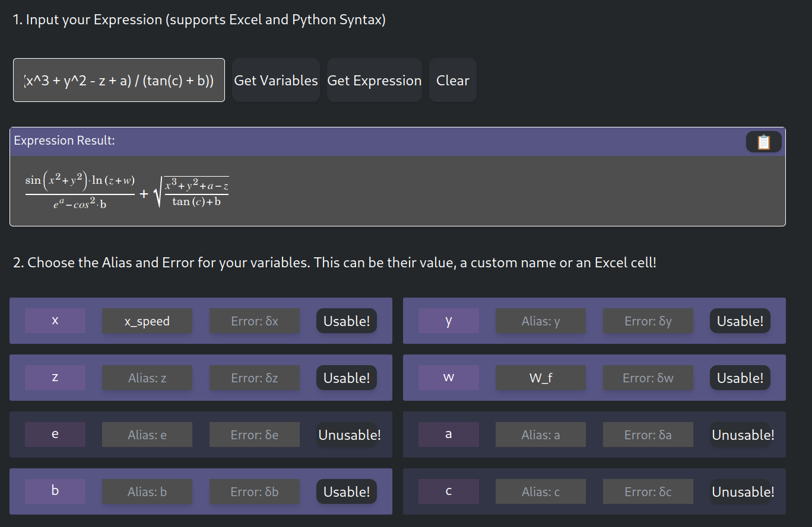
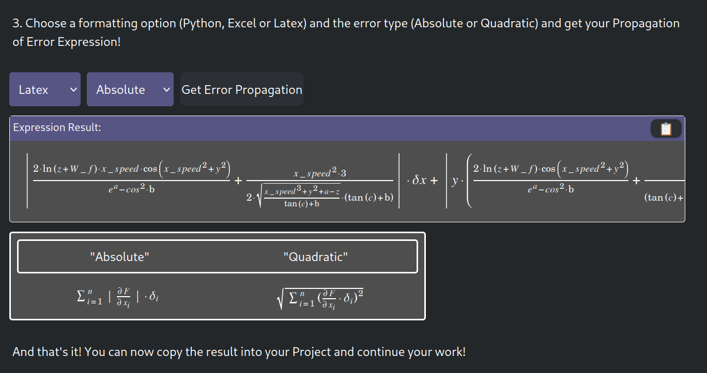

# Propagation of Error Calculator

Welcome to the Propagation of Error Calculator! This web application allows you to automatically calculate the Propagation of Error (or Propagation of Uncertainty) for any given expression. It supports various syntaxes including Excel, Python, and LaTeX, making it a versatile tool for your data analysis and scientific needs.


## Live Website

Try out the application live at [Propagation of Error Calculator](https://errorpropagation.com).


1. **Simply input your math expression, it automatically recognizes all the variables!**



2. **Get the result in your preferred format!**



## Features

- **Expression Input**: Enter mathematical expressions using Excel or Python syntax.
- **Variable Management**: Define aliases and errors for your variables.
- **Error Propagation**: Choose formatting options (Python, Excel, or LaTeX) and error types (Absolute or Quadratic) to calculate the error propagation.
- **Copy Results**: Easily copy the results into your Excel, Python, or LaTeX projects.
- **User-Friendly Interface**: Clean and intuitive design for a seamless user experience.


## Getting Started

To get started with the Propagation of Error Calculator locally, follow these steps:

### Prerequisites

- **Node.js**: Ensure you have [Node.js](https://nodejs.org/) installed on your machine.

### Installation

1. Clone the repository:

```bash
git clone https://github.com/MIBismuth/error-propagation-calculator
```
2. Navigate to the project directory:

```bash
cd ErrorPropagationProduction
```

3. Install the dependencies:

```bash
npm install
```


4. Start the development server:

```bash
npm run dev
```

Open your browser and visit http://localhost:3000 to see the application in action.

## Usage

- Input Expression: Enter your mathematical expression in the input field. The application supports both Excel and Python syntax.

- Get Variables: Click the "Get Variables" button to extract variables from your expression.

- Get Expression: Click the "Get Expression" button to convert your expression into LaTeX format.

- Clear: Use the "Clear" button to reset the input fields and start over.

- Define Variables: Choose the aliases and errors for your variables in the provided menu.

- Get Error Propagation: Select the desired formatting option (Python, Excel, or LaTeX) and error type (Absolute or Quadratic), then click "Get Error Propagation" to see the results.

- Copy Results: Copy the generated results into your project.

## Contributing

Contributions are welcome! If you have suggestions, bug reports, or want to contribute to the development of this project, please follow these steps:

1. Fork the repository.
2. Create a new branch for your feature or bug fix.
3. Commit your changes and push to your fork.
4. Open a pull request with a description of your changes.

## License

This project is licensed under the GPL v3.0. See the [LICENSE](LICENSE) file for details.

## Acknowledgments

[José Lopes](https://joselopes.dev) and João Rei - Authors of the project.

The development was inspired by the sheer suffering of calculating error propagations during physics laboratories. Never again.

Thank you for visiting our project!
